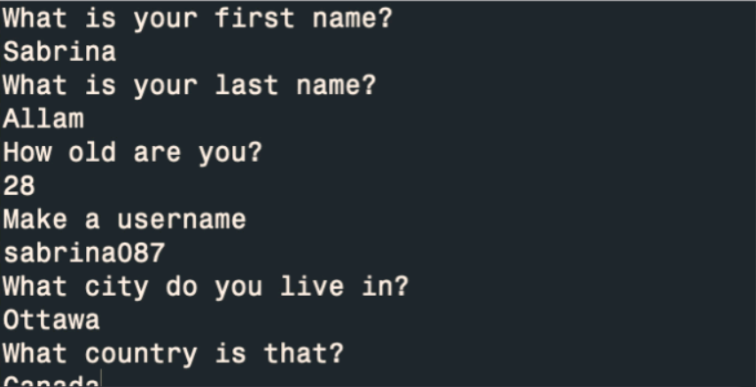
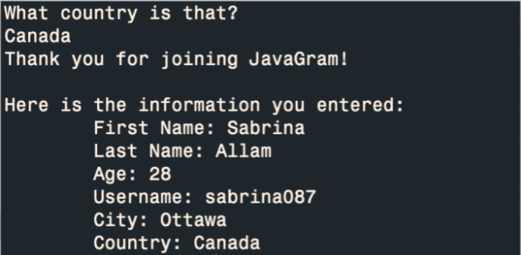

# JavaGram
In this program, you're a new developer for JavaGram: Instagram for Java developers. Your job is to make the **sign-up** page for new users.

## Careful from the **nextLine()** trap

Before you start this workbook, I need to warn you about the: **"nextLine() trap".**

- **nextLine()** gets "skipped" if you put it after of **nextInt()** , **nextDouble()**, **nextLong()**. You can expect this behaviour when you try to pick up the username.

- The solution is to add a throwaway **nextLine()** before the **"real" nextLine().**

## Task 1: Ask the user questions

First, you will ask the user to enter:

- their first name

- their last name

- their age

- a username

- their city

- their country.

Your output should appear as follows:

